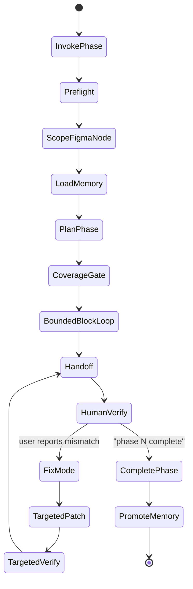

# Phased Figma-to-Velt Architecture Plan

Date: 2026-07-01
Status: research and implementation plan only. Do not build until approved.

## Executive conclusion

The proposed phase-by-phase, human-checkpointed approach is directionally right, but it is not sufficient by itself.

The real fix is not "split the file and keep looping until perfect." That can still run for hours inside a single phase. The corrected target is:

1. Scope each invocation to one Figma phase node.
2. Convert that phase into a finite block/state checklist.
3. Run the existing block-by-block mechanical verifier with hard budgets.
4. Stop at a human checkpoint with evidence, diffs, uncertainty, and exact fix instructions.
5. In fix mode, patch the existing implementation surgically and re-verify only the affected blocks plus any shared-contract smoke checks.
6. Promote stable learnings into a structured cross-phase memory only when the user says the phase is complete.

This should materially improve practical latency because it reduces per-invocation Figma context, per-run block count, and rework. It will not guarantee shorter total compute if every phase still requires many Builder/Judge attempts. The biggest remaining control knob is bounded iteration plus fix-mode reuse, not phasing alone.

## Evidence summary

### What the repo does today

The current plugin is already not a naive greenfield loop. It has a substantial block-by-block redesign:

- `.mcp.json` registers `figma-desktop` at `http://127.0.0.1:3845/mcp` and `claude-in-chrome` for browser verification.
- `commands/run.md` invokes `velt-orchestrator` in setup mode, then `owned-loop` mode. It explicitly says termination is `scripts/verdict-gate-blocks.mjs`, not `/goal`.
- `agents/velt-planner.md` calls for Figma MCP intake, deterministic `designSpec` extraction, `scripts/enumerate-blocks.mjs`, a Connect Map, and a coverage matrix.
- `agents/velt-builder.md` is scoped to one work-list item and retries from Judge feedback instead of intentionally regenerating the whole design.
- `agents/velt-judge.md` verifies one block by seed/drive/capture/visual-diff/delta-compare/layer-probe/contract-probe/stability-probe and writes `block-report.json`.
- `scripts/verdict-gate-blocks.mjs` is the mechanical terminator. A missing block, missing drive assertion, missing visual diff, missing delta compare, or missing stability result is `INCOMPLETE`, not pass.

The current architecture already solved one major failure: an LLM cannot self-declare "done" after sampling a few states. The new architecture should reuse this substrate rather than replace it.

### Figma MCP and extraction scoping

Current repo paths:

- Preferred deterministic extraction: `scripts/figma-extract.mjs rest <fileKey> <nodeId> --out <dir> --svg`.
- Fallback extraction: Planner saves Figma MCP outputs and runs `scripts/figma-extract.mjs from-mcp <dump.json>`.
- Block enumeration: `scripts/enumerate-blocks.mjs rest <fileKey> <nodeId> --out <runDir>` exports one frame PNG per state block.

Local state observed on this machine:

- `node scripts/figma-extract.mjs token status` reported no token, so this environment would use the MCP fallback unless a token is stored.

Live tool metadata from the installed Figma MCP tools says:

- `get_design_context` requires a concrete `nodeId`. If a design URL lacks `node-id`, the agent should ask for a node-specific URL.
- `get_metadata` can omit `nodeId` only to list top-level pages; if the URL includes `node-id`, extract it and pass it.
- `get_screenshot` also requires `fileKey` and `nodeId`, and supports a `maxDimension` cap.
- For a branch URL, use the branch key as the file key.

Official Figma REST docs back the same shape:

- The REST API exposes a JSON representation of files and layers as nodes and says callers can access and isolate objects/layers: [Figma REST API introduction](https://developers.figma.com/docs/rest-api/).
- `GET /v1/files/:key` supports an `ids` query parameter that returns selected node subtrees plus ancestors, and `depth` to limit traversal: [Figma file endpoints](https://developers.figma.com/docs/rest-api/file-endpoints/).
- `GET /v1/files/:key/nodes` retrieves specific node IDs, and Figma node URLs contain both file key and node id.
- `GET /v1/images/:key` renders specific node IDs and can batch IDs. Figma notes that `contents_only=false` can increase processing time because more document content may be included.
- These are Tier 1 endpoints with rate limits. Figma recommends batching and caching when rate-limited: [Figma rate limits](https://developers.figma.com/docs/rest-api/rate-limits/).

Conclusion: a phase must be a node-scoped URL. A file-level URL is not acceptable for this workflow except as a discovery step. The best phase unit is a Figma Section or Frame whose children are the state-variant frames for one screen/flow.

### Where the time likely goes

I could not reproduce the reported 12-24 hour run here because the live target app and Figma file are not available in this repo. The closest evidence is therefore repo forensics plus local timing of deterministic gates.

Measured local proxy timings:

- `node scripts/check-guide.mjs`: 0.04s.
- `node scripts/validate.mjs`: 0.12s, with one warning about missing plugin version.
- `node golden/run-golden.mjs`: 0.04s. It calibrated style/layout/icon/layer/contract/verdict/stability gates.

Repo forensics in `BLOCK-BY-BLOCK-REDESIGN-PLAN.md` are more informative than these cheap script timings:

- A real design section had 16 explicit state frames.
- A previous run built about 5 of those and stopped, which quantified the "happy path only" failure.
- The block scripts were validated against the live file: 16/16 blocks enumerated, frame PNGs exported, visual diffs localized missing hover actions, and the full 16-block E2E returned `INCOMPLETE` instead of falsely passing.
- Remaining live-run pain was content-matched seeding, false-clean guardrails, and per-block iteration, not the pure Node gates.

My bottleneck judgment:

- Cheap deterministic gates are not the dominant cost.
- Figma extraction/context can be a serious front-loaded cost if the input node contains many frames, especially when REST is unavailable and MCP returns large XML/code/screenshot context.
- The long 12-24h wall time is more likely dominated by model turns plus browser-driven Builder/Judge iterations, compounded by large block counts and regeneration/re-analysis.
- Phasing helps if it reduces the number of blocks and extracted context per invocation. It does not help enough if a single phase still contains many blocks and has an unbounded loop.

### Documentation drift found

There is a current instruction conflict:

- `commands/run.md`, `agents/velt-orchestrator.md`, `agents/velt-judge.md`, `skills/velt-operating-brief/SKILL.md`, and `guide/build-methodology.md` say termination is `verdict-gate-blocks.mjs`.
- `guide/verifying-a-customization.md`, `guide/rules.md` R20/R25/R26, `skills/velt-verify/SKILL.md`, and `golden/run-golden.mjs` still mention `/goal` or older `verdict-gate.mjs` semantics in places.

That must be fixed during migration. Otherwise the plugin can receive contradictory stop conditions.

### Memory and persistence patterns

Claude Code docs say each session starts with a fresh context and persistent knowledge comes from `CLAUDE.md` files and auto memory. They also note `CLAUDE.md` and auto memory are context, not enforcement, and that auto memory is plain markdown stored per project: [Claude Code memory docs](https://code.claude.com/docs/en/memory).

For this plugin, `CLAUDE.md` is not the right place for phase state:

- Phase state is runtime data, not always-on project instruction.
- It can become large quickly.
- It must be queryable by phase/block/file/selector.
- It must be invalidated when the guide, manifest, target repo, or source Figma node changes.

The repo already has the correct pattern: append-only run journals and `.velt-customize/` run artifacts in the target repo. The new architecture should formalize that into structured JSON files:

- Within-phase memory: phase manifest, journal, block reports, attempt summaries, fix cycles, unresolved issues.
- Cross-phase memory: promoted tokens, component mappings, naming conventions, host integration facts, and user-approved corrections.

### Prior art

The prior art supports this corrected approach:

- Figma2Code argues that real design-to-code needs both Figma metadata and images, not screenshots alone, and notes limitations in layout responsiveness and maintainability: [Figma2Code](https://arxiv.org/abs/2604.13648).
- Design2Code found models lag on recalling visual elements and generating correct layout, which matches this repo's hard focus on whole-surface layout and missing/extra-element gates: [Design2Code](https://arxiv.org/abs/2403.03163).
- UI2Code-N explicitly frames UI-to-code as an interactive multi-turn generation/editing/polishing problem with visual feedback, which supports a bounded repair loop over one-shot generation: [UI2Code-N](https://arxiv.org/abs/2511.08195).

## Validated target architecture

The target should be "phase wrapper around the existing block loop", not a new end-to-end loop.

High-level flow:



Key correction: `BoundedBlockLoop` is not "until the goal is achieved". It is "until all blocks pass, become verified partial/gap, become blocked, or a budget/plateau stop triggers a human checkpoint."

## Phase definition and scoping

### Phase input contract

The command should accept:

```text
/velt-customize:run <figma-phase-node-url> [target repo path] --phase <phaseId> --mode <mode> [--notes "..."]
```

Allowed modes:

- `strictly wireframe`
- `strictly primitives`
- `wireframes + primitives`
- `freeform`

Required Figma URL shape:

- Must be a Figma Design URL with `node-id`.
- The node should be one Section or Frame containing one screen/flow and its state-variant frames.
- If no `node-id` is present, the plugin should stop before planning and ask for a phase-specific node URL.

Recommended Figma structure:

```text
Phase 03 - Comments sidebar
  Empty state
  Loading
  Input focused
  Input filled
  Comment left - default
  Hover
  Options menu
  Resolved
```

The state frames inside a phase are not separate components. They are block/state variants of one component/surface unless the Planner recognizes a genuinely different Velt surface.

### State variants to props/state, not duplicate components

The Planner should map state frames to:

- `blocks[].state` for visual verification.
- `blocks[].drive` for how to reach the state in the live app.
- component props or host props only when the design cue justifies them.
- wireframe variants only when the same Velt component needs distinct render contexts, not when it is simply hover/open/resolved state.
- primitive state only when the mode allows primitives and the guide/data model proves the state can be represented cleanly.

Examples:

- `Hover` maps to drive steps and CSS/state visibility for actions, not a duplicate ThreadCard component.
- `Options menu` maps to driving the Velt Options trigger and styling the content slot, not a duplicate menu component.
- `Resolved` maps to Velt resolved state plus Unresolve slot/icon, not a copied static card.

## Modes

### Strictly wireframe

Allowed:

- host props justified by design evidence.
- CSS variables/classes.
- wireframe slots and variants.
- event-driven additions only if they do not require custom runtime behavior beyond documented hooks/events.

Disallowed:

- primitives for custom composition.
- headless.
- React interactivity inside wireframes.

Exit behavior:

- If a goal needs primitives/headless, mark it as `mode_blocked` and present the exact reason at handoff.
- Do not silently escalate layers.

### Strictly primitives

Allowed:

- primitives and primitive composition.
- CSS needed to style those primitives.
- documented hooks/events/data fields.

Disallowed:

- new wireframe slot customization except the minimum registry/mounting that the SDK requires and the user explicitly approves.
- headless unless the user moves to freeform.

Exit behavior:

- If a design requires a wireframe-only slot with no primitive equivalent, mark `mode_blocked`.

Open decision: whether "strictly primitives" should permit leaf wireframes as a primitive-adjacent escape hatch. I recommend "no" because the word "strictly" should mean the plugin reports mode mismatch instead of quietly mixing layers.

### Wireframes + primitives

Allowed:

- The guide's cheapest viable layer per piece.
- Mixed surface where wireframes handle structure and primitives handle interactive/custom UI pieces.

Exit behavior:

- This is the pragmatic default for high-fidelity builds when the user wants both approaches available.

### Freeform

Allowed:

- The guide decision tree can choose CSS, wireframe, primitive, mixed, or propose headless/gap.

Exit behavior:

- The coverage gate must say what it chose and why.
- Headless remains out of v1 unless explicitly approved for the phase.

## Bounded loop design

Default budgets should be explicit and overrideable:

```json
{
  "phaseWallClockMinutes": 90,
  "planningWallClockMinutes": 20,
  "maxBlocksPerPhaseDefault": 8,
  "maxAttemptsPerBlock": 4,
  "maxNoProgressAttemptsPerBlock": 2,
  "maxLayerEscalationsPerBlock": 1,
  "maxFixAttemptsPerUserIssue": 3,
  "captureTimeoutMs": 30000,
  "driveAssertTimeoutMs": 8000
}
```

Stop conditions:

- All blocks pass mechanically.
- All remaining unmet goals are verified gaps/partials.
- Environment blocks verification.
- Phase wall-clock is reached.
- A block hits max attempts.
- No-progress repeats twice.
- Normalized diff hash repeats.
- Attempt N returns to the hash from N-2.
- Unmet goal set is identical twice with no failing-count decrease.
- A previous passing goal regresses.

When a budget/plateau stop happens, the plugin should not fail silently and should not keep looping. It should hand off with `needs_human_review`, the best current diff, and a suggested fix instruction.

## Exit criteria

Block `PASS` requires all of:

- `built: true`
- `driven: true`
- capture PNG exists.
- frame PNG exists.
- `visualDiff.regions` has no region with `fill >= 0.05`.
- `deltaCompare.ok === true`.
- `reconciliation.ok === true`.
- `contract.ok === true`.
- `stability.ok === true`.
- every `mustSupply` slot is present and contains design-supplied content.
- icon identity verified for relevant slots.
- no render/console hard gate.
- static rules scan clean.

Phase `MACHINE_PASS` requires:

- every block in `phase.manifest.blocks` is `PASS`, or
- a block is `PARTIAL` only with a verified SDK/mode gap and user-visible report entry, or
- a block is `BLOCKED` only by an environment condition reported at handoff.

Phase `USER_COMPLETE` requires the user to say `phase N complete`. Machine pass alone should not promote cross-phase memory.

## Fix mode

Fix mode is central. It should not regenerate a phase.

Invocation shape:

```text
/velt-customize:run --fix <phaseId> "<specific mismatch>"
```

or, if continuing the same phase:

```text
/velt-customize:fix "<specific mismatch>"
```

Fix-mode algorithm:

1. Load `phase-state.json`, `phase-manifest.json`, `connect-map.json`, `block-report.json`, and recent `journal.jsonl`.
2. Classify the user issue:
   - visual mismatch
   - behavior/mount-map failure
   - mode violation
   - wrong Figma mapping
   - stale/shared memory conflict
   - environment issue
3. Locate affected scope:
   - block(s) by state label, user text, visual diff region, or selector.
   - surface and Velt slot from Connect Map.
   - owning TSX file(s), CSS selector(s), icon asset(s), host props.
4. Patch only those owners.
5. Re-run smoke checks:
   - TypeScript/build if relevant.
   - affected block visual/delta/contract/stability.
   - any other block sharing a changed selector, component, host prop, icon, or wireframe variant.
6. Append a fix-cycle event to the journal.
7. Handoff with before/after evidence and residual risk.

Impact rules:

- CSS selector changed -> verify every block using that selector.
- shared host prop changed -> verify every block for that surface.
- mount-map/slot tree changed -> run contract probe for the whole phase, plus affected visual blocks.
- icon asset changed -> verify every block containing that slot.
- purely local layout value changed -> verify the affected block plus the nearest adjacent block/state if the same component appears there.

## Memory design

Storage location in the target repo:

```text
<target-repo>/.velt-customize/
  index.json
  memory/
    project-memory.json
    memory-journal.jsonl
  phases/
    <phaseId>/
      phase-manifest.json
      phase-state.json
      designSpec.json
      connect-map.json
      blocks.json
      block-report.json
      journal.jsonl
      reports/
      frames/
      shots/
      diffs/
```

This should be gitignored in the target repo. Product code still stays in `components/velt/ui-customization/`.

### Phase manifest schema

```json
{
  "schemaVersion": 1,
  "phaseId": "phase-03-comments-sidebar",
  "status": "planned|running|machine_pass|needs_human_review|user_complete|blocked",
  "figma": {
    "url": "https://figma.com/design/...?...node-id=1-3398",
    "fileKey": "string",
    "nodeId": "1:3398",
    "nodeType": "SECTION|FRAME",
    "sourceVersion": "figma lastModified/version if available"
  },
  "target": {
    "repo": "/abs/path",
    "gitHeadAtStart": "sha or null",
    "framework": "react"
  },
  "mode": "strictly_wireframe|strictly_primitives|wireframes_primitives|freeform",
  "budgets": {
    "phaseWallClockMinutes": 90,
    "maxAttemptsPerBlock": 4,
    "maxNoProgressAttemptsPerBlock": 2
  },
  "inputs": {
    "extraInstructions": "string",
    "acceptedMemoryIds": ["mem_001"]
  },
  "blocks": [
    {
      "id": "hover",
      "figmaNodeId": "1:4444",
      "state": "hover",
      "surface": "comments-sidebar",
      "liveSelector": "velt-comment-dialog-internal",
      "framePng": "frames/hover.png",
      "status": "pass|fail|partial|blocked|not_started"
    }
  ],
  "outputs": {
    "coverageReport": "reports/velt-coverage-report.md",
    "handoffReport": "reports/phase-handoff.md",
    "sdkGapReport": "reports/sdk-gap-report.md"
  }
}
```

### Cross-phase memory schema

```json
{
  "schemaVersion": 1,
  "projectId": "hash(target repo remote + root path)",
  "updatedAt": "2026-07-01T00:00:00.000Z",
  "guideFingerprint": {
    "manifestHash": "sha256 manifest/velt-codeconnect.json",
    "guideHash": "sha256 selected guide files"
  },
  "entries": [
    {
      "id": "mem_001",
      "kind": "token|component_mapping|naming|host_integration|learned_correction|gap|user_preference",
      "scope": {
        "feature": "comments",
        "surface": "comments-sidebar",
        "mode": "wireframes_primitives",
        "selector": ".hw-card"
      },
      "value": {
        "summary": "Use the compact sidebar ThreadCard variant for all sidebar states.",
        "details": {}
      },
      "evidence": {
        "phaseId": "phase-03-comments-sidebar",
        "blockIds": ["default", "hover"],
        "artifactPaths": ["phases/phase-03-comments-sidebar/block-report.json"]
      },
      "confidence": "confirmed|tentative|deprecated",
      "promotedByUser": true,
      "createdAt": "2026-07-01T00:00:00.000Z",
      "lastValidatedAt": "2026-07-01T00:00:00.000Z",
      "invalidatesWhen": {
        "guideHashChanges": true,
        "manifestHashChanges": true,
        "targetPackageChanges": ["@veltdev/react"],
        "figmaFileChanges": false
      }
    }
  ]
}
```

Stale-memory guard:

- Load only `confidence=confirmed` entries by default.
- Mark entries stale when guide hash, manifest hash, Velt package version, or owning file changes.
- Tentative entries can inform planning but must be tagged `assumed` and re-verified.
- Promote memory only on `phase N complete`, not on machine pass.
- Never let memory override guide/reference facts. Guide + live SDK still win.

### Within-phase memory schema

```json
{
  "schemaVersion": 1,
  "phaseId": "phase-03-comments-sidebar",
  "attempts": [
    {
      "attemptId": "a004",
      "blockId": "hover",
      "kind": "build|judge|fix",
      "startedAt": "iso",
      "endedAt": "iso",
      "changedFiles": ["components/velt/ui-customization/styles.css"],
      "normalizedDiffHash": "sha256",
      "failingDiffCount": 2,
      "goalsMet": 8,
      "unmetGoalIds": ["hover-actions-visible"],
      "verdict": "FAIL",
      "artifacts": ["diffs/hover.png"]
    }
  ],
  "openIssues": [
    {
      "id": "issue_001",
      "blockId": "hover",
      "description": "Resolve and kebab actions are missing on hover.",
      "lastEvidence": "diffs/hover.png",
      "suggestedFix": "Supply ThreadCard.Options.Trigger and ResolveButton slot; verify hover drive assert."
    }
  ]
}
```

## Handoff protocol

Every stop should produce a human-readable handoff, even if the machine pass is clean.

Required handoff fields:

- Phase id, mode, Figma node, target repo.
- Status: `MACHINE_PASS`, `NEEDS_HUMAN_REVIEW`, `PARTIAL`, or `BLOCKED`.
- What changed, grouped by files.
- Diff summary with paths.
- Blocks verified and their statuses.
- Evidence artifacts: frame, shot, diff, delta rows, contract/stability result.
- What the plugin is uncertain about.
- What could not be verified and why.
- Any mode-blocked or SDK-gap entries.
- Any host changes required.
- Exact fix instructions format, for example:
  - `Fix phase-03 hover: the resolve icon should be check-circle, not default Velt check.`
  - `Fix phase-03 options-open: menu width is 24px too wide.`
- Whether the plugin recommends saying `phase N complete` or asking for a fix.

## Phase completion protocol

When the user says `phase N complete`:

1. Confirm the phase exists and is latest.
2. Freeze phase artifacts:
   - `phase-state.json` status -> `user_complete`.
   - append `user_complete` event to `journal.jsonl`.
   - write `reports/phase-final-summary.md`.
3. Promote memory:
   - tokens actually used.
   - component mappings that passed.
   - naming conventions the user accepted.
   - learned corrections from fix cycles.
   - verified gaps and mode constraints.
4. Do not promote:
   - failed attempts.
   - tentative assumptions.
   - environment-specific workarounds unless user explicitly approves.
5. Update `.velt-customize/index.json`:
   - phase status.
   - next recommended phase number.
   - current cross-phase memory hash.

## Expected improvement

If the full design has `F` state frames and each phase has `f` frames, extraction, block enumeration, and verification artifact count scale roughly with `f`, not `F`. A 16-frame flow split into four 4-frame phases gives shorter feedback cycles and lower per-invocation context.

But total wall-clock does not necessarily drop by 4x:

- Each phase has setup overhead.
- Shared components may need re-verification.
- A difficult block can still burn all attempts.
- Browser seeding can dominate.

The practical win is expected from:

- lower Figma/MCP context per invocation.
- fewer blocks before human feedback.
- no full regeneration during fixes.
- cross-phase memory avoiding repeated token/mapping decisions.
- hard stop on plateau.

If iteration cycles are the dominant cost, phasing alone mainly relocates latency. The real reducer is fix mode plus bounded loop plus targeted re-verification.

## Migration steps

1. Add a phase plan/schema layer.
   - New `docs` plan approved first.
   - Then add schema docs or JSON schema under `schemas/` if desired.

2. Add phase command parsing.
   - Parse Figma node URL, `--phase`, `--mode`, `--notes`.
   - Reject file-level URLs without `node-id`.
   - Keep existing command as backward-compatible shorthand, but warn that file-level runs are legacy.

3. Add `.velt-customize` phase directories in the target repo.
   - `index.json`
   - `phases/<phaseId>/`
   - `memory/project-memory.json`

4. Thread phase scope into Planner.
   - Only call Figma MCP/REST for the phase node.
   - Only enumerate blocks under that node.
   - Store `phase-manifest.json`.

5. Add mode constraints.
   - Planner must tag every decision with allowed/disallowed by mode.
   - Builder must receive mode limits.
   - Judge/handoff reports mode-blocked goals.

6. Add budget enforcement to Orchestrator.
   - Wall-clock budget.
   - max attempts per block.
   - no-progress/plateau.
   - phase stop status and handoff.

7. Add targeted fix mode.
   - Load prior phase artifacts.
   - Build impact graph from Connect Map: block -> surface -> slot -> selector -> file.
   - Patch only affected code.
   - Re-run affected block(s) and shared checks.

8. Add memory lifecycle.
   - Read confirmed relevant memory at phase start.
   - Append all learnings as tentative during phase.
   - Promote confirmed entries only on `phase N complete`.
   - Invalidate on guide/manifest/package changes.

9. Update stale docs.
   - Replace `/goal` termination references in `guide/verifying-a-customization.md`, `guide/rules.md`, `skills/velt-verify/SKILL.md`, and golden checklist output.
   - Make `verdict-gate-blocks.mjs` the canonical stop condition everywhere.

10. Add tests.
   - Unit tests for phase URL parsing.
   - Unit tests for memory stale guard.
   - Unit tests for affected-block selection in fix mode.
   - Golden update asserting the printed checklist no longer mentions `/goal`.
   - Existing gates: `node scripts/check-guide.mjs`, `node scripts/validate.mjs`, `node golden/run-golden.mjs`, `Codex plugin validate .`.

## Risks and mitigations

| Risk | Mitigation |
|---|---|
| User passes a huge phase | Warn when block count exceeds default max; recommend splitting before build. |
| Figma URL lacks node id | Halt before planning and ask for a node-specific phase URL. |
| REST token unavailable | Use MCP fallback but require smaller phase nodes; report lower fidelity. |
| Figma rate limits | Batch image exports, cache phase artifacts, honor `Retry-After`. |
| Memory goes stale | Hash guide/manifest/package versions; load stale memory only as tentative. |
| Strict mode is impossible | Report `mode_blocked` instead of silently switching layers. |
| Fix touches shared CSS | Impact graph re-verifies all blocks sharing the selector. |
| A phase still loops for hours | Enforce wall-clock, attempt, plateau, and regression stops. |
| Browser seeding is flaky | Treat as `BLOCKED` with evidence, not `FAIL` and not pass. |
| Documentation conflict reintroduces `/goal` | Make stale `/goal` cleanup a required migration step. |
| Total project time remains high | Optimize after POC using measured per-stage telemetry. |

## Open questions for approval

1. Should the user always split phases manually, or should the plugin offer a discovery mode that lists likely phase nodes from the top-level pages?
2. What default budget do you want per phase: 45, 90, or 120 minutes?
3. Should `strictly primitives` allow leaf wireframes as an escape hatch, or should it report mode mismatch strictly?
4. Should cross-phase memory live only in the target repo `.velt-customize/`, or should there also be a machine-level memory shared across client repos?
5. Can `phase N complete` promote memory when the phase is `PARTIAL`, or only when every block is machine pass?
6. Should the plugin require a Figma REST token for production runs, or keep MCP fallback as supported but lower fidelity?
7. Should old, completed phase artifacts be archived/compressed automatically after promotion?

## Single-phase proof-of-concept plan

Goal: prove the phase wrapper reduces per-invocation scope without weakening verification.

Scope:

- One manually selected phase node with 2-4 state frames.
- Mode: `strictly wireframe` or `wireframes + primitives`.
- Target repo: a known Velt React app.
- Existing block scripts reused unchanged where possible.

POC implementation:

1. Add phase URL parser and `phase-manifest.json`.
2. Require `node-id`.
3. Run current extraction/enumeration only for that node.
4. Add budgets to orchestrator for this one phase.
5. Write handoff report.
6. Add minimal fix mode that targets one CSS/slot mismatch and re-verifies the affected block.
7. Add memory skeleton, but promote only one simple confirmed token/mapping on `phase complete`.

POC measurements to capture:

- phase node block count.
- extraction time.
- planning turn count.
- build attempts per block.
- judge time per block.
- number of files changed.
- full phase wall-clock.
- fix-mode wall-clock for one targeted issue.
- whether any stale docs or memory affected behavior.

POC acceptance:

- A phase with 2-4 blocks reaches handoff within the chosen wall-clock budget.
- A deliberate missing state cannot pass because `verdict-gate-blocks.mjs` returns `INCOMPLETE`.
- A targeted fix changes only affected files and re-verifies only affected/shared blocks.
- `phase complete` promotes memory only after user approval.

