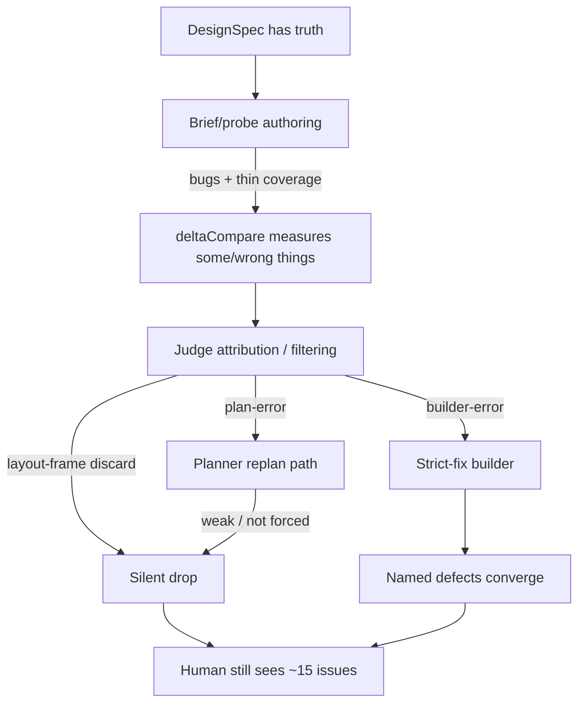
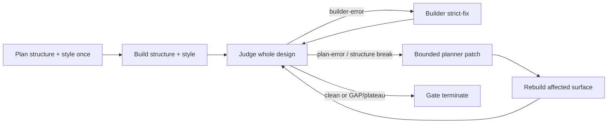

# Accuracy fix plan — post `2026-07-22-fresh-1`

Source evidence:
- Independent UI issues: `learnings/iteration-1.md`, `learnings/iteration-2.md` (`iteration-3.md` empty)
- Plugin Judge: `learnings/judge-1.md`, `learnings/judge.2.md`
- Plugin Builder: `learnings/builder-1.md`
- Independent reviews: `learnings/review-builder-1.md`, `learnings/review-judge-1-2.md`
- Run artifacts: `runs/2026-07-22-fresh-1/` (`verdict.json`, `judge-defects.json`, `beyondPlan.json`, briefs/probes/results)

---

## Verdict

The fix loop works for named defects. Accuracy fails because **defects never enter that loop**.

After challenging the writeups against the run artifacts, the reviews are mostly right, but the failure mode is sharper than “Judge is blind” or “Builder is weak.”

---

## Challenged findings (what held / what didn’t)

| Claim | Verdict after artifact check |
|---|---|
| Builder fixed Judge #1 well | **Confirmed.** Judge #2 cleared icon size, send opacity/bg, click timeouts. |
| Judge only finds asserted properties | **Mostly true, incomplete.** Engine measured much more; Judge discarded it. |
| Measurement is sparse | **Partly true.** Bigger issue: **Judge over-filtering** + **dead plan-error path**. |
| Placeholder never gated | **Confirmed, stronger than review.** `expectedTexts: []` on all 8 briefs; scaffold filters `typeof n.text === "string"` while extractor emits `{content, family, …}`. Worse: composer Placeholder `369:29430` is bound to `.vc-message` with color `#1a1917` while designSpec/mock say `#848079` + “Comment or tag others with @”. |
| Typography/spacing totally missed | **Overstated.** `content-height` off by 35–431px and many style diffs were measured. Judge #2 left dialog at `diffCount: 48` / `actionableForBuilder: 0`. |
| iconLint pass despite black-dot filter | **Confirmed.** Lint is source-vs-export paths, not live slot/render identity. |
| Structure invariants missing | **Confirmed.** Contract engine supports containment/cardinality; briefs only assert Panel/Composer/List-level mounts. |
| Mock approval gate missing | **Confirmed, secondary.** Appearance pass + wrong mock can agree; not the primary iter-2 killer. |
| Iter 3 independent findings | **Unavailable.** `learnings/iteration-3.md` is empty. Plugin evidence is one run with Judge→fix→re-audit. |

Smoking gun from Judge #2 totals: **`builder: 5`, `plan: 8`**, while gate still had **50 failures**. Most measured truth never became a builder work order. Sidebar-header note literally says residual diffs are “layout-frame / selector-collision — not defects.”

---

## Root-cause stack (priority order)

1. **Probe/brief authoring bugs** — wrong selector/value for placeholder; empty `expectedTexts`; card/panel paint lost to `layout-frame` + `box:null`.
2. **Judge work-order compression** — batches real diffs into one avatar “plan-error”, drops layout-frame/gross height, duplicates symptoms across blocks.
3. **Plan-error dead-end** — 8 planner rows (avatar binding, caret misbind) not forced through a replan→rebuild→remeasure loop before claiming progress.
4. **Coverage floor too low** — gate allows ≥2 elements; sidebar-header asserts only 4; panel radius / composer height / thread containment never required.
5. **Builder constraints amplify the above** — strong at named fixes; appearance pass is soft; strict-fix cannot invent unlisted defects; structure freeze with no hard `BLOCKED_FOR_REPLAN`.
6. **icon-lint false confidence** — path match ≠ correct live glyph in slot.

---

## Intended loop architecture (general plugin behavior)

**Goal:** Plan once; converge on Builder ↔ Judge. Planner is a rare exit hatch, not the inner loop.

| Loop | When | What runs |
|---|---|---|
| **Outer (once)** | Start of run | plan-structure → build-structure → snapshot → plan-style → build-style |
| **Inner (default)** | After first Judge | Builder strict-fix ↔ Judge re-audit until clean / plateau / budget |
| **Exception (bounded)** | Only `plan-error(*)`, bad probe bind, or `BLOCKED_FOR_REPLAN` | One planner patch (cap 1–2 per family) → resnapshot/restyle as needed → back to inner loop |
| **Never** | — | Full Plan→Build→Judge every FAIL; replan because “pixels look off” |

**Orchestrator rules to enforce this:**
1. Strict-fix receives only `builder-error` rows (unchanged).
2. If `routeToPlanner > 0`, **pause** that family’s builder fixes until the planner patch lands or the row is GAP’d with evidence — no silent parking.
3. Planner re-entry is ticketed (`issueKey`, affected blocks, cap). Exceeding cap → GAP/blocker, not endless replan.
4. Structure edits after style plan still invalidate fingerprint (existing rule); that is a controlled exception path, not the hot loop.

This matches product intent: customers get a strong Builder↔Judge polish loop on any design; planning is setup, not the convergence engine.

---

## Plan to fix (highest accuracy)

### Phase 0 — Freeze a regression oracle from this run (1 day)

Do this before changing agents.

1. Snapshot a **human gold issue list** from iter-1/2 (collapse to ~15 root issues, not 30).
2. For each issue, classify: `would-measure-today` / `measured-but-filtered` / `never-asserted`.
3. Add golden fixtures under `golden/` that fail today and must pass after fixes:
   - `expectedTexts` derivation from object `n.text`
   - placeholder node → composer selector + `#848079` + visible text
   - card/panel border/radius/background as paint
   - content-height FAIL must produce a builder-or-planner row (not silent)
   - one containment contract: Reply inside card

**Success:** a scripted scorecard that maps “independent UI issues → mechanical detection.”

---

### Phase 1 — Close the known mechanical holes (highest ROI)

These are bugs, not prompt tweaks.

| Fix | Where | Why |
|---|---|---|
| Read `n.text.content` (and static UI strings only) into `fixture.expectedTexts` | `scripts/brief-scaffold.mjs` ~184–186 | Ungates placeholder/labels end-to-end |
| Assert `expected.text` / visible text in browser probe | `scripts/delta-compare.mjs` | Style-only placeholder can “pass” while empty |
| Refuse wrong placeholder binding | scaffold + `--lint-style` | Placeholder → `.vc-message` + wrong color is poison |
| Promote painted containers out of paintless `layout-frame` | `nodeKindOf` / element selection | Card border, panel radius, composer chrome |
| Auto-author thread contracts | scaffold + manifest `contract.parts` | one card/thread; Reply/actions `requiredAncestor` card |
| Raise coverage floor | `verdict-gate-blocks.mjs` | Require paint+text slots from slice, not ≥2 |
| Gross `content-height` must be a first-class defect row | judge emit path / report-block | Already measured; currently discarded |

**Success:** replaying measure on this run’s live DOM (or a frozen capture) would flag missing placeholder text, wrong card border/radius, and density failures as actionable rows.

---

### Phase 2 — Fix Judge work-order quality (not “more vision”)

Judge already measures. It fails at **routing measured truth**.

1. **Issue keys / dedupe**  
   `issueKey` + `affectedBlocks[]` so icon w/h × N blocks is one root fix order.

2. **No silent discard of FAIL diffs**  
   Every `deltaCompare` fail must become:
   - `builder-error`, or
   - `plan-error(*)` with a replan ticket, or
   - explicit `noise` with reason + evidence  
   Ban “diffCount 48, actionable 0” without a noise ledger.

3. **layout-frame policy tighten**  
   Keep collision advisory for geometry-only wrappers.  
   Do **not** suppress: flex-direction row≠column on mapped containers, content-height, painted border/radius/background, text presence.

4. **Interaction defects must include cause packet**  
   bbox, opacity, pointer-events, `elementFromPoint`, matched count, failure screenshot — before emitting click/hover timeout.

5. **icon identity second pass**  
   After icon-lint, compare mounted SVG `d`/slot assignment live (Judge step already claims this; make it scripted).

**Success:** on a re-audit of this design, actionable rows cover ≥80% of the independent gold list categories (not pixel-perfect count).

---

### Phase 3 — Enforce Builder↔Judge inner loop + real plan-error exit hatch

Today: plan-errors are excluded from builder and not proven repaired; the intended “plan once, polish on Builder↔Judge” shape is not enforced.

1. Orchestrator: default convergence is **only** Builder strict-fix ↔ Judge. Do not re-dispatch planners on ordinary `builder-error` FAILs.
2. If `routeToPlanner > 0`, **pause** that family’s builder fixes until style/structure planner patch lands or the row is GAP’d with evidence — no silent parking.
3. Cap planner re-entry at **1–2 patches per family** (`issueKey` + affected blocks). Exceeding cap → GAP/blocker, not Plan→Build→Judge forever.
4. Mechanical rebind pass for known classes (avatar `::before`, caret vs input) before blaming CSS.
5. After a planner patch: fingerprint invalidate → resnapshot → restyle → back to Judge (existing stale-style-plan rule; enforce for probe rebinds too).

**Success:** avatar/initials “7 blocks plan-error” cannot persist across a full 5c→5d cycle without either fix or GAP evidence; ordinary polish never re-plans the whole design.

---

### Phase 4 — Increase Builder’s visible power (best-effort match before Judge)

**Aim:** Builder puts maximum effort into matching the design **before** handoff. Judge remains the authority (Builder never self-declares PASS). Today the appearance pass is soft prose; Builder can “finish” while the UI is obviously wrong.

#### 4a. Give Builder the same eyes the human uses (mechanical, not vibes)

1. **Pre-Judge self-audit (mandatory in style mode, before return)**  
   For every block in the family, Builder must run the same measurement stack Judge uses (`measure-block.mjs` + icon-lint + skeleton arrangement check), persist results, and **fix what it can** until:
   - `diffCount` stops dropping (local plateau), or
   - remaining diffs are explicitly classified `plan-error` / `BLOCKED_FOR_REPLAN` / accepted noise with evidence.  
   Handoff is refused if self-audit artifacts are missing or stale.

2. **Triple-image appearance artifact per block** (required file under the phase dir):  
   `{ blockId, figmaFramePng, mockScreenshot, liveScreenshot, regions[], unresolved[], disposition }`  
   - Compare **content-independent chrome** against Figma frame (size, spacing, borders, radius, alignment, icon identity, composer height, card enclosure).  
   - Compare **composed template** against the family mock (content-matched).  
   - Every significant region must be fixed, or listed with disposition — empty `unresolved` or explicit blockers only.

3. **Visible-text gate (mechanical)**  
   Placeholders, static labels, and non-data chrome strings from the brief must be painted and non-empty before style handoff (pairs with Phase 1 `expectedTexts` / text probe). Missing composer placeholder = hard fail for Builder, not a Judge surprise.

4. **Structural invariant check at structure + style handoff** (even for `buildMinimal`):  
   - one card per thread/annotation  
   - replies + reply affordances inside parent card  
   - composer = one surface (avatar + placeholder + send)  
   - no phantom extra wrappers creating a second visible border  
   Fail → fix in structure mode, or `BLOCKED_FOR_REPLAN` (style mode must not paper over it).

#### 4b. Let Builder act on what it sees (without becoming a rogue redesign agent)

5. **`BLOCKED_FOR_REPLAN`** — if style-mode sees wrong enclosure/cardinality/slot, stop and ticket planner. Do not continue to Judge with known bad structure.

6. **Beyond-plan fixes stay, but must be logged** (`beyondPlan.json`) and must cite a designSpec/mock/Figma evidence source — no invented values (existing rule, enforce via handoff).

7. **`builder-discovered-defect` channel** — for material mismatches Builder cannot safely fix under current mode (wrong plan value, probe bind, SDK gap). Emit with screenshots + measured boxes; orchestrator routes to Judge/planner. Never silently ignore.

8. **Strict-fix completion bar** — named Judge rows clean **and** fresh self-audit shows no new high-severity appearance/structure defects. Same visible bar in first style build and in fix mode.

#### 4c. Prompt / agent contract changes (after scripts exist)

Update `agents/velt-builder.md` + orchestrator handoff:

- Appearance pass is **gated by artifacts + self-audit exit**, not “I looked.”  
- Best-effort duty: fix every content-independent mismatch visible in Figma/mock/live before returning.  
- Judge still concludes; Builder’s job is to make Judge’s first audit as clean as possible.  
- Do **not** allow free redesign of plan values; do allow mechanism fixes (flex wrappers, clip, visibility, sizing that the spec already states).

**Success criteria for Builder visual power:**
- Style build cannot return without per-block appearance artifacts + self-audit.
- Missing placeholder / broken card enclosure / obvious density failure is caught in Builder stage on the canary, not first seen by a human after Judge.
- Judge’s first audit has fewer trivial visual misses; remaining rows are hard/SDK/plan issues.

---

### Phase 5 — Mock fidelity gate (after 1–3)

Score `mocks/<family>.html` vs frame PNG (reuse `trials.mjs` `MOCK_GATE_PCT` idea) before plan-style. Fail closed above threshold.

Do this after probe/judge fixes so you don’t chase mock noise while measurement is still blind. A wrong mock poisons Builder’s appearance pass — pin mock quality before asking Builder for best-effort visual match.

---

## What not to do (rejected approaches)

- **“Just make Judge look harder at screenshots.”** visualDiff is advisory for good reasons (real vs dummy data). The bug is failing to convert measured/region signals into named assertions.
- **“Let strict-fix freely restyle anything it sees.”** That regresses determinism; use discovery → route instead.
- **“Rewrite the whole planner.”** beyondPlan shows many style gaps are known; the loop didn’t force them into gated assertions.
- **“Trust iconLint + diffCount 0.”** Both can agree while UI is wrong.
- **“Re-plan every Judge FAIL.”** Wrong shape. Inner loop is Builder↔Judge; planner is bounded exception only.
- **“Builder self-declares PASS from screenshots.”** Increases visible effort, not authority. Gate + Judge still conclude.

---

## Delivery order (recommended)

1. Phase 0 scorecard + goldens  
2. Phase 1 scaffold/probe/coverage bugs  
3. Phase 2 Judge emit/dedupe/no-silent-drop  
4. Phase 3 Builder↔Judge enforcement + plan-error exit hatch  
5. Phase 4 Builder visible power (self-audit + appearance artifacts + invariants)  
6. Phase 5 mock gate  

Phases 1–3 alone should close most of the independent iter-2 detection/routing gap. Phase 4 is what makes Builder catch Figma mismatches **before** Judge. Phase 5 protects Builder’s reference.

**Recommended first implementation cut:** land Phase 1–2 as a measurement-only patch (no agent prompt changes), dry re-measure against this run’s app/DOM to prove detection lift, then layer orchestrator loop rules (Phase 3) and Builder self-audit (Phase 4).

---

## Accuracy target for the next demo run

Use the same Figma demo as canary:

- Independent gold issues resolved or mechanically explained: **≥90%**
- No block with `diffCount > 0` and `actionableForBuilder + routeToPlanner == 0` unless every residual is in a noise ledger
- Placeholder text visible and asserted
- Card border/radius/panel edge asserted
- Thread containment contract green
- plan-error rows either fixed or GAP’d with evidence in the same run
- Style build produces per-block appearance + self-audit artifacts; Judge is not the first place trivial visual misses appear
- Convergence stays on Builder↔Judge; planner re-entry ≤2 per family unless GAP
- Human spot-check of hover/selected/1-reply/N-replies still required until scorecard is trusted

---

## Implementation status (2026-07-22)

Landed in plugin scripts + agents (offline gates green: `golden/run-golden.mjs`, `validate.mjs`, `check-guide.mjs`).

| Phase | Status | Key artifacts |
|---|---|---|
| 0 | Done | `learnings/gold-issues-fresh-1.json`, `scripts/score-gold-issues.mjs` |
| 1 | Done | `brief-scaffold.mjs` (`textContentOf`, chrome `expectedTexts`, root paint, contracts, coverage floor, probe-bind lint, `--force` refresh); `delta-compare.mjs` `compareText`; gate `minAssert` |
| 2 | Done | `emit-judge-defects.mjs` (no silent drop; issueKey; layout-frame noise; avatar→plan-error); smoke `causePacket`; `icon-live-lint.mjs` |
| 3 | Done (agent contract) | Orchestrator Builder↔Judge inner loop + bounded `5c2` plan-error hatch |
| 4 | Done | `appearance-review.mjs`, `builder-self-audit.mjs`, `structural-invariants.mjs`, `BLOCKED_FOR_REPLAN`, discovered-defect channel |
| 5 | Done | `mock-gate.mjs` before plan-style |

Frozen-run dry score (old deltas + refreshed briefs + new emitter): **gold detection 17/19 (89%)**. No block may leave measured FAILs without builder/plan/noise rows. Live canary re-measure still required for outcome (≥90% resolved).

---

## Demo-polish doctrine (landed 2026-07-23)

Teaching the plugin the Harvey human-fix loop (options kebab, ToggleReply, sidebar scroll, CSS debt):

| Artifact | Change |
|---|---|
| `knowledge/mechanism-polish.json` | Playbook: doctrine, vision loop, checklist, traps |
| `knowledge/sdk-gotchas.json` | options-collapse, sidebar-flex-scrollport, composer-presence `:has` trap |
| `scripts/knowledge.mjs` | `mechanism-polish` command + load key |
| `agents/velt-builder.md` | DEMO-POLISH mandatory in style + fix; VALUES vs MECHANISM |
| `agents/velt-orchestrator.md` | Plan once; refuse first-shot-only handoff; CSS-debt after structure patch |
| `agents/velt-judge.md` | Mechanism checklist → first-class builder-errors |
| `agents/velt-planner-style.md` | Do not plan 0×0 host collapses / mock-height scroll kills |
| `skills/velt-operating-brief/SKILL.md` | Inner loop = Builder DEMO-POLISH ↔ Judge |
